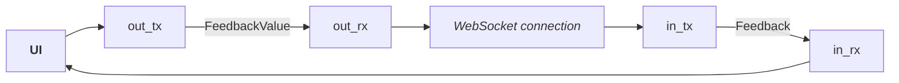
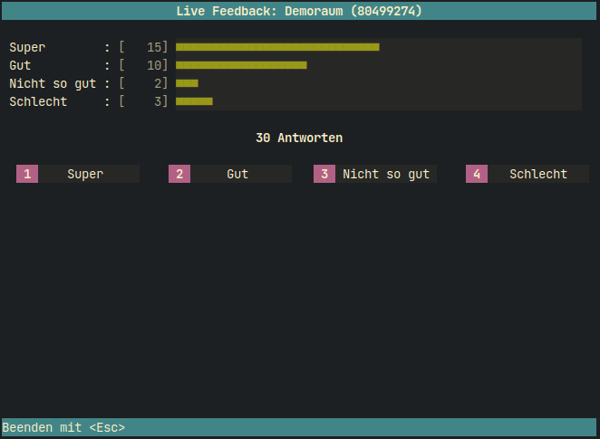

# ARSnova-client

An ARSnova live feedback client library

## Usage

### Initialize client and login

Create a client using and request guest login.

```rust
let client = Client::new("https://ars.particify.de/api").expect("client created");
let client = client.guest_login().await.expect("logged in");
```

### Request room information

The room information contains the name, ID and the 8-digit short ID of the requested room.

```rust
let room_info = client.get_room_info("12345678").await.expect("room information");
```

### Feedback

You can get feedback information in two different ways: Direct request and getting notified about changes.

#### Send feedback

Register a channel receiver and send incoming feedback using the client.

```rust
let (fb_tx, fb_rx) = channel::<FeedbackValue>(10);

let _ = client.register_feedback_receiver(&cli.room, fb_rx).await;
```

#### Direct request

You can request (poll) the current feedback:

```rust
let feedback = client.get_feedback("12345678").await.expect("current feedback");
```

#### Getting notified

To handle feedback changes, you can use a handler function or forward the feedback to a channel.

Handle feedback changes using a function:

```rust
let _ = client.on_feedback_changed(&cli.room, FeedbackHandler::Fn(|feedback| {/*...*/})).await;
```

Forward feedback to a channel:

```rust
let (in_tx, in_rx) = tokio::sync::mpsc::channel::<Feedback>(10);

let _ = client.on_feedback_changed(&cli.room, FeedbackHandler::Sender(in_tx)).await;
```

#### Both: Send and receive Feedback updates

Handle remote feedback changes and feedback updates to be sent:



```rust
let (in_tx, inrx) = channel::<Feedback>(10); // Incoming from remote
let (out_tx, out_rx) = channel::<FeedbackValue>(10); // Outgoing to remote

let _ = client.on_feedback_changed(&cli.room, FeedbackHandler::SenderReceiver(in_tx, out_rx)).await;
```

## Example

See [`examples/arsnova-client-tui.rs`](examples/arsnova-client-tui.rs) for a simple terminal-based feedback client
application.

### How to run

```shell
cargo run --example arsnova-client-tui
```

```
Terminal-based ARSnova live feedback client

Usage: arsnova-client-tui [OPTIONS] <ROOM>

Arguments:
  <ROOM>  Raum

Options:
  -u, --url <URL>  API-URL [default: https://ars.particify.de/api]
  -h, --help       Print help
  -V, --version    Print version
```

